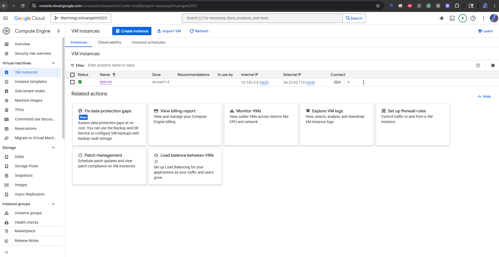
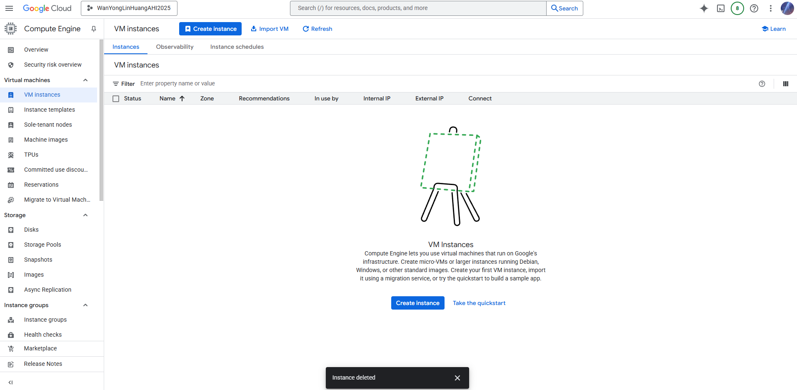
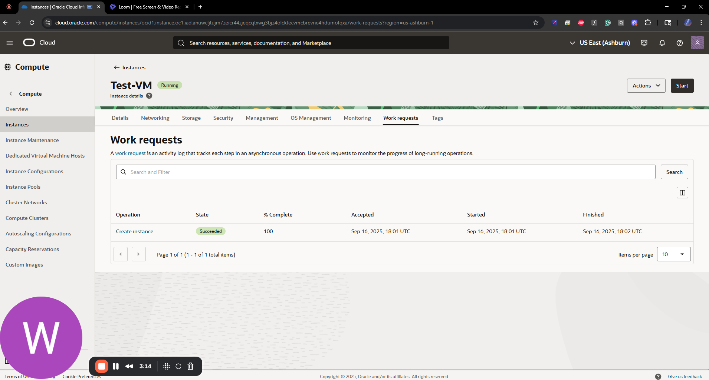
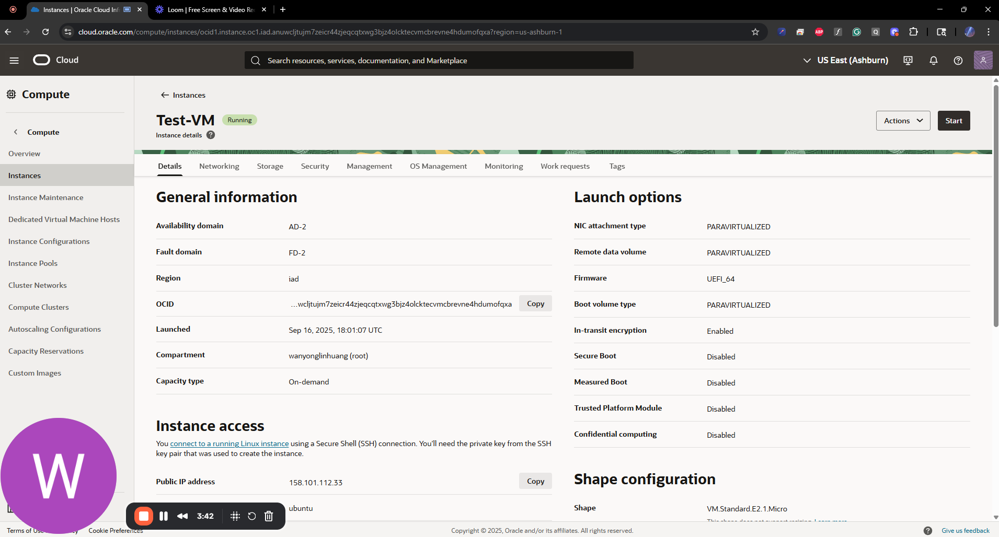
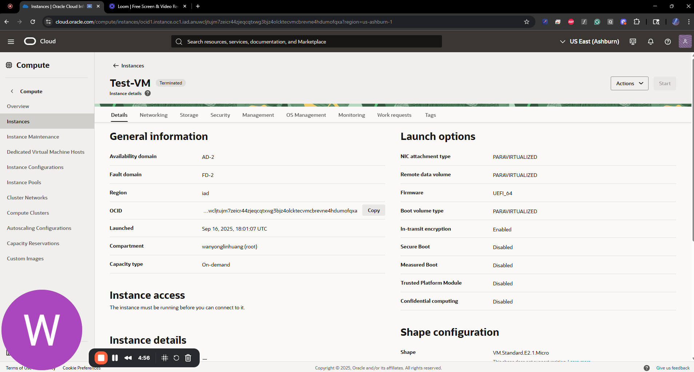

# VM Lifecycle on GCP and OCI — Tutorial

## Video
Loom: Google Cloud <https://www.loom.com/share/02d6ad210ef9427cabdde7e69b7a9178?sid=d7d2173d-03a3-42ed-86a9-c05e47f3b06e>

Oracle Cloud <https://www.loom.com/share/ade5ec9d928d406b833fbab5bfb85ff8?sid=ac8c190f-45c2-4428-bf91-331187da30ce>

Comparison <https://www.loom.com/share/a3accabd6fe443f69f50628332d81a49?sid=c90bb24b-0406-4e59-bae2-a44887cfaf84>

## Prereqs
- Cloud access to GCP and OCI
- No PHI/PII; smallest/free-tier shapes

---

## Google Cloud (GCP)
### Create
1. Log in → Create/Select project → Create vm/instance
2. Name the vm/instance
3. Region/zone: <us-east1> 
4. Machine type: <E2-micro>
5. Image: Ubuntu LTS
6. Boot disk: default minimal
7. Network: default VPC; ephemeral public IP

### Start/Stop
- Start: <state shows RUNNING>
- Stop: <state shows TERMINATED/STOPPED>

### Delete
- Delete instance and verify no disks/IPs remain

---

## Oracle Cloud (OCI)
### Create
1. Compartment: <root>
2. Networking: VCN with Internet Connectivity (defaults)
3. Shape: <E2.1-micro>
4. Image: Ubuntu
5. Public IP: ephemeral
6. Boot volume: default minimal

### Start/Stop
- Start: <state shows RUNNING>
- Stop: <state shows STOPPED>

### Terminate
- Terminate and delete boot volume; verify cleanup

---

## Reflections
### Similarities
- <brief bullets>

### Differences
- <brief bullets>

### Preference (OCI vs GCP) and Why
- <one short paragraph>