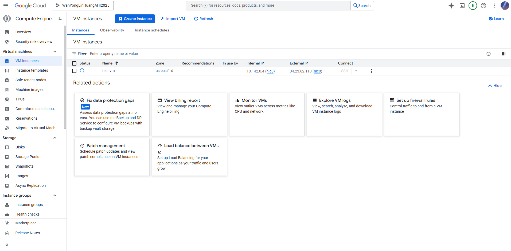

# VM Lifecycle on GCP and OCI — Tutorial

## Video
Loom: Google Cloud <https://www.loom.com/share/02d6ad210ef9427cabdde7e69b7a9178?sid=d7d2173d-03a3-42ed-86a9-c05e47f3b06e>

Oracle Cloud <https://www.loom.com/share/ade5ec9d928d406b833fbab5bfb85ff8?sid=ac8c190f-45c2-4428-bf91-331187da30ce>

Comparison <https://www.loom.com/share/a3accabd6fe443f69f50628332d81a49?sid=c90bb24b-0406-4e59-bae2-a44887cfaf84>

## Prereqs
- Cloud access to GCP and OCI
- No PHI/PII; smallest/free-tier shapes

---

## Google Cloud (GCP)
### Create
1. Log in → Create/Select project → Create vm/instance
2. Name the vm/instance
3. Region/zone: us-east1 
4. Machine type: E2-micro
5. Image: Ubuntu LTS
6. Boot disk: default minimal
7. Network: default VPC; ephemeral public IP

### Start/Stop
- Start: 
- Stop: 

### Delete
- Delete instance and verify no disks/IPs remain

---

## Oracle Cloud (OCI)
### Create
1. Compartment: root
2. Networking: VCN with Internet Connectivity (defaults)
3. Shape: E2.1-micro
4. Image: Ubuntu
5. Public IP: ephemeral
6. Boot volume: default minimal

### Start/Stop
- Start:

### Terminate
- Terminate and delete boot volume; verify cleanup

---

## Reflections
### Similarities
- Both OCI and GCP have a web interface allowing for customizable options to create a vm.
- They also provide a step-by-step course on the creation of a vm.

### Differences
- GCP's interface has a simpler layout.
- GCP contains more options for operating systems.
- OCI requires more configuration before being able to create and run a vm.

### Preference (OCI vs GCP) and Why
- I prefer GCP over OCI due to its user-friendly interface and how quickly a vm can be created. OCI contains more detailed options which is good for more professional use but I prefer beginner-friendly platforms. GCP provides faster and reliable steps to create a vm whereas OCI provides more advanced options that is not geared towards quick setup of a vm.